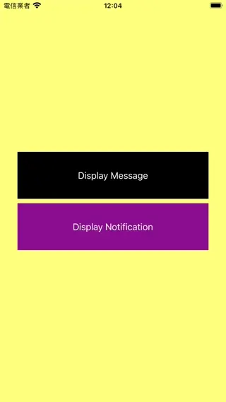

# WWMessageBar

[](https://developer.apple.com/swift/) [](https://developer.apple.com/swift/)  [](https://developer.apple.com/swift/) [](https://developer.apple.com/swift/)

## [Introduction - 簡介](https://swiftpackageindex.com/William-Weng)
- [Simple message bar.](https://github.com/JanGorman/SwiftMessageBar)
- [簡單的訊息欄。](https://www.appcoda.com.tw/interactive-animation-uiviewpropertyanimator/)



## [Installation with Swift Package Manager](https://medium.com/彼得潘的-swift-ios-app-開發問題解答集/使用-spm-安裝第三方套件-xcode-11-新功能-2c4ffcf85b4b)

```bash
dependencies: [
    .package(url: "https://github.com/William-Weng/WWMessageBar.git", .upToNextMajor(from: "1.1.0"))
]
```

### [Function - 可用函式](https://ezgif.com/video-to-webp)
|函式|功能|
|-|-|
|configure(delegate:height:barType:displayDelayTime:dismissDelayTime:)|相關數值設定|
|display(title:message:level:tag:)|顯示文字訊息|
|dismiss(completion:)|隱藏訊息|

## [WWMessageBar.Delegate](https://mockuphone.com/)
|函式|功能|
|-|-|
|messageBar(_:didTouched:)|訊息Bar被點到|
|levelSettings(messageBar:)|等級相關設定|

## Example
```swift
import UIKit
import WWMessageBar

final class ViewController: UIViewController {
    
    override func viewDidLoad() {
        super.viewDidLoad()
        WWMessageBar.shared.configure(delegate: self)
    }
    
    @IBAction func displayMessage(_ sender: UIButton) {
        WWMessageBar.shared.display(message: Date(), level: .debug)
        WWMessageBar.shared.display(title: "info", message: Date(), level: .info)
        WWMessageBar.shared.display(message: Date(), level: .notice)
    }
    
    @IBAction func displayNotification(_ sender: UIButton) {
        WWMessageBar.shared.configure(delegate: self, barType: .notification)
        WWMessageBar.shared.display(message: Date(), level: .critical, tag: "[Notification]")
        WWMessageBar.shared.display(title: "warning", message: Date(), level: .warning, tag: "[Notification]")
    }
}
    
extension ViewController: WWMessageBar.Delegate {
    
    func messageBar(_ messageBar: WWMessageBar, didTouched info: WWMessageBar.MessageInformation?) {
        messageBar.dismiss()
    }
    
    func levelSettings(messageBar: WWMessageBar) -> [WWMessageBar.Level : WWMessageBar.LevelSetting]? {
        return [
            .debug: (icon: UIImage(systemName: "arrow.up.circle"), tintColor: .lightGray, fontColor: .red),
            .critical: (icon: UIImage(named: "ちいかわ"), tintColor: .magenta, fontColor: .black),
        ]
    }
}
```
